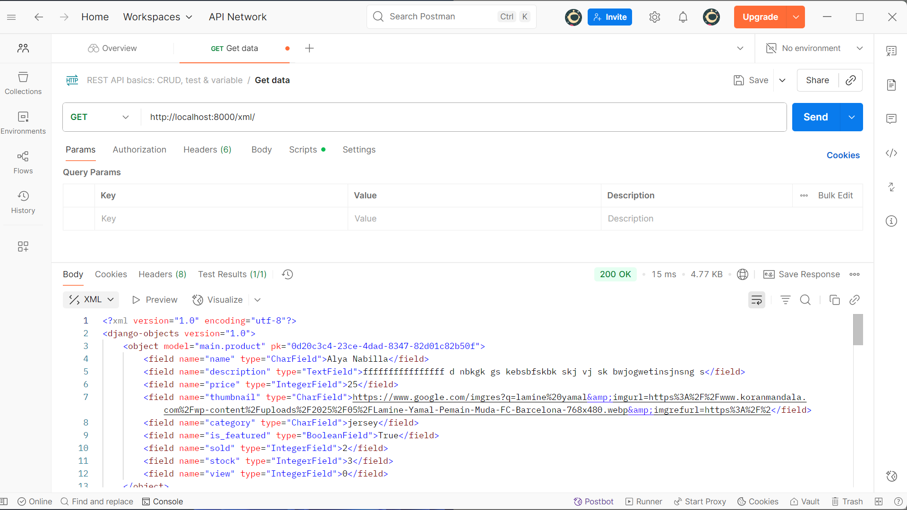
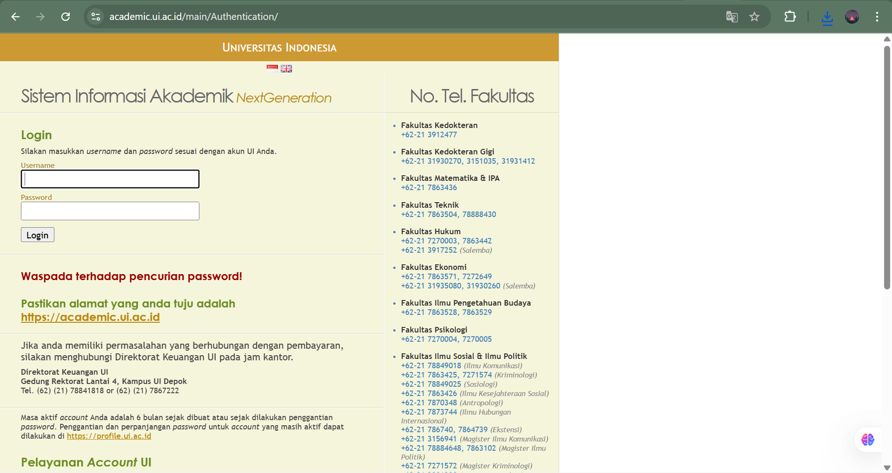

# README — Django Project: `false9-store` 

**Pemilik / Pembuat:** Alya Nabilla Khamil (Nabillakha)

## Link Aplikasi (PWS)

> Aplikasi yang sudah berhasil di-deploy dapat diakses melalui tautan berikut: **\https://alya-nabilla-false9store.pbp.cs.ui.ac.id/**

---

## Ringkasan singkat

Proyek ini merupakan tugas dari mata kuliah Pemrograman Berbasis Platform (PBP). Aplikasi yang dikembangkan bernama False9 Store, yaitu sebuah aplikasi Football Shop sederhana berbasis Django yang saat ini masih dalam tahap pengembangan.

---
# Tugas 2 

## Implementasi proyek step-by-step

1. **Membuat proyek Django baru**

   1. **Membuat Direktori & Virtual Environment**  
      Pertama, saya membuat direktori baru khusus untuk proyek ini agar terpisah dari repositori sebelumnya. Lalu membuat virtual environment serta mengaktifkannya. Virtual environment penting untuk mengisolasi dependencies proyek ini dari proyek Python lain di komputer. Jadi kalau ada perbedaan versi library, tidak akan saling mengganggu.

      *Membuat folder baru dan masuk ke dalamnya:*
      ```bash
      cd ~
      mkdir false9-store
      cd false9-store
      ```

      *Membuat virtual environment untuk isolasi dependencies:*
      ```bash
      python -m venv env
      ```

      *Mengaktifkan virtual environment:*
      ```bash
      env\Scripts\activate
      ```

   2. **Menambahkan Dependencies**  
      Saya membuat file `requirements.txt` berisi daftar dependencies utama:
      ```text
      django
      gunicorn
      whitenoise
      psycopg2-binary
      requests
      urllib3
      python-dotenv
      ```
      Masing-masing library punya fungsinya sendiri: Django sebagai framework inti, gunicorn sebagai web server untuk production, whitenoise untuk mengatur file statis, psycopg2-binary sebagai driver PostgreSQL, requests dan urllib3 untuk kebutuhan HTTP request, serta python-dotenv agar proyek bisa membaca environment variables dari file `.env`.

      Instalasi dilakukan dengan:
      ```bash
      pip install -r requirements.txt
      ```

   3. **Inisiasi Proyek Django**  
      Saya membuat proyek Django bernama `false9_store` dengan:
      ```bash
      django-admin startproject false9_store .
      ```
      Titik di akhir perintah berguna supaya struktur file langsung dibuat di root folder, sehingga file `manage.py` tidak berada di dalam subdirektori tambahan. Inisiasi ini menghasilkan file penting seperti `settings.py`, `urls.py`, dan konfigurasi dasar Django.

   4. **Konfigurasi Environment Variables**  
      Untuk memisahkan pengaturan development dan production, saya menambahkan dua file environment:
      - `.env` → untuk development lokal (SQLite).  
      - `.env.prod` → untuk production (PostgreSQL di server PWS).  

      File `.env` berisi `PRODUCTION=False`, sedangkan `.env.prod` berisi kredensial PostgreSQL dari PWS dengan `PRODUCTION=True`. Dengan pemisahan ini, saya tidak perlu mengubah kode setiap kali berpindah environment, cukup mengganti file environment yang dipakai.

   5. **Konfigurasi Settings Django**  
      Saya memodifikasi `settings.py` supaya bisa membaca konfigurasi dari file `.env` menggunakan python-dotenv.  
      Selain itu:  
      - Menambahkan `ALLOWED_HOSTS` agar proyek hanya bisa diakses dari host tertentu (misalnya `localhost` dan `127.0.0.1`).  
      - Menambahkan variabel `PRODUCTION` untuk menentukan apakah Django akan menggunakan SQLite (development) atau PostgreSQL (production).  

   6. **Migrasi Database & Menjalankan Server**  
      Setelah konfigurasi selesai, saya melakukan migrasi awal dengan:
      ```bash
      python manage.py migrate
      ```
      Proses ini membuat struktur database bawaan Django seperti tabel user, autentikasi, dan session.  
      Lalu menjalankan server lokal dengan:
      ```bash
      python manage.py runserver
      ```
      Jika membuka `http://localhost:8000` muncul tampilan default Django, artinya proyek berhasil dibuat.

   7. **Menghentikan Server & Menonaktifkan Virtual Environment**  
      Untuk menghentikan server cukup tekan `Ctrl + C` di terminal, lalu menonaktifkan virtual environment dengan:
      ```bash
      deactivate
      ```

   8. **Membuat Repositori GitHub**  
      - Membuat repositori baru bernama `false9-store` dengan visibilitas public.  
      - Inisialisasi repositori lokal dengan:
        ```bash
        git init
        ```

   9. **Menambahkan .gitignore**  
      Membuat file `.gitignore` untuk mengabaikan file yang tidak perlu, seperti `db.sqlite3`, file log, virtual environment, dan file konfigurasi editor.

   10. **Menghubungkan ke GitHub**  
       - Menambahkan remote ke GitHub:
         ```bash
         git remote add origin <url-repo>
         ```
       - Membuat branch utama `master`.  
       - Menambahkan file, commit, lalu push ke GitHub.

   11. **Deployment ke PWS**  
       - Login ke PWS menggunakan akun SSO UI.  
       - Membuat proyek baru bernama `false9store`.  
       - Menyimpan Project Credentials dan menjalankan Project Command.

   12. **Menambahkan Environment Variables**  
       - Menyalin isi `.env.prod` ke tab *Environs* di PWS.  
       - Memastikan `PRODUCTION=True` dan `SCHEMA=tugas_individu`.

   13. **Menyesuaikan settings.py**  
       Menambahkan URL PWS ke dalam `ALLOWED_HOSTS`.

   14. **Push ke PWS**  
       - Melakukan `git add`, `git commit`, dan:
         ```bash
         git push pws master
         ```
       - Mengecek status deployment hingga `Running` agar aplikasi bisa diakses melalui URL PWS.

2. **Membuat aplikasi `main`**

   * `python manage.py startapp main`. Direktori baru akan dengan nama `main` akan terbentuk
   * Menambahkan `'main'` ke `INSTALLED_APPS` pada `settings.py` agar Django mengenali app.

3. **Routing**

   Dibuat file `urls.py` di dalam aplikasi main untuk memetakan fungsi view yang sudah ada. Kemudian, di `urls.py` proyek, routing ditambahkan dengan `include('main.urls')` agar aplikasi main bisa diakses dari URL utama.

4. **Mendesain model `Product`**

   * Di `main/models.py` dibuat class `Product(models.Model)` dengan field sesuai checklist.

5. **Membuat fungsi view sederhana**

    Di `views.py`, ditambahkan fungsi `show_main` yang mengirimkan data (seperti nama aplikasi, nama, dan kelas) ke template HTML. Data ini ditampilkan dengan menggunakan variabel konteks di template.

6. **Migrasi database lokal**

   * `python manage.py makemigrations main`
   * `python manage.py migrate`
   * Saya juga membuat migration terpisah setiap kali mengubah model agar histori perubahan jelas.

7. **Routing fungsi view ke `urls.py` aplikasi**

    Fungsi `show_main` tadi dihubungkan melalui urls.py aplikasi main, sehingga ketika URL tertentu diakses, template yang sudah dibuat bisa muncul di browser.

8. **Deployment ke PWS dan push ke GitHub**

   Setelah aplikasi berjalan secara lokal, proyek dihubungkan ke PWS (Pacil Web Service) dengan membuat proyek baru di dashboard PWS, menambahkan environment variables, mengatur `ALLOWED_HOSTS`, lalu melakukan `git push pws master`. Setelah status deployment berubah menjadi Running, maka aplikasi bisa diakses melalui URL PWS. Dan juga untuk push semua ke GitHub


## Bagan request-response dan keterkaitan berkas (urls.py, views.py, models.py, HTML)

```scss
    [Client / Browser]
        │
        ▼
   Mengirim Request
        │
        ▼
  urls.py (Routing)
        │
        ▼
  views.py (Logic)
        │
        ▼
 models.py (Database)  ←→  Database (SQLite/PostgreSQL)
        │
        ▼
   Template HTML (Rendering)
        │
        ▼
 [Response kembali ke Client]
```

**Penjelasan singkat:**

* `urls.py` berfungsi sebagai peta jalan. Request yang masuk akan diarahkan ke fungsi tertentu di `views.py`
* `views.py` berisi logika untuk memproses request, bisa mengambil/memanipulasi data dari models.py.`models.py` .
* `models.py` menjadi representasi tabel database. Jika view butuh data, ia akan mengambil lewat model.
* Setelah data siap, view akan memanggil template HTML. Template ini digunakan untuk menampilkan data dalam bentuk halaman web.
* Hasil akhirnya berupa response HTML yang dikirim balik ke browser client.

## Peran `settings.py` dalam proyek Django

`settings.py` adalah pusat konfigurasi proyek Django. Beberapa peran dan konfigurasi penting:

* `INSTALLED_APPS`: daftar app yang aktif dalam proyek — harus berisi `'main'` agar model dan admin-nya terdeteksi.
* `DATABASES`: konfigurasi koneksi database (default: SQLite untuk development).
* `ALLOWED_HOSTS`: domain atau host yang diizinkan mengakses aplikasi (penting untuk produksi).
* `DEBUG`: mode debug (harus `False` di produksi).
* `SECRET_KEY`: kunci rahasia proyek (jangan di-commit ke publik).
* `TEMPLATES`: lokasi dan pengaturan engine template.
* `STATIC_URL`, `STATIC_ROOT`: pengaturan file statis untuk collectstatic di produksi.
* `MIDDLEWARE`, `ROOT_URLCONF`, `WSGI_APPLICATION` dan pengaturan lain yang mengontrol lifecycle request, keamanan, dan integrasi eksternal.

     `settings.py` mengatur bagaimana aplikasi berperilaku (database, app, file statis, host, middleware, dll.).Tanpa `settings.py`, proyek Django tidak bisa tahu bagaimana cara berjalan di environment tertentu.

## Cara kerja migrasi database di Django

Migrasi di Django adalah cara untuk menyamakan kode model Python dengan struktur database:

1. Saat menulis/ubah model di `models.py`, Django belum langsung mengubah database.  
2. Dengan perintah `python manage.py makemigrations`, Django membuat file migrasi (seperti “catatan perubahan”).  
3. Dengan `python manage.py migrate`, Django mengeksekusi file migrasi itu untuk membuat atau mengubah tabel di database.  
4. Proses ini bisa dilakukan berkali-kali sesuai perubahan model, jadi database selalu sinkron dengan kode.  

## Kenapa Django sering dipilih sebagai permulaan belajar framework web?

Beberapa alasan yang membuat Django cocok sebagai starting-point:

* **Batteries-included**: Django menyediakan banyak fitur bawaan (ORM, authentication, admin, forms, templating) sehingga pembelajar tidak harus merakit banyak komponen sendiri.
* **Konvensi yang jelas**: struktur proyek yang teratur (settings, urls, views, models, templates) memudahkan pemahaman arsitektur web.
* **Keamanan**: Django otomatis melindungi banyak celah umum (CSRF, XSS, SQL injection) bila digunakan sesuai dokumentasi.
* **Dokumentasi & komunitas besar**: banyak tutorial, paket pihak ketiga, dan contoh nyata.
* **Scale & praktik industri**: Django digunakan di startup dan perusahaan besar sehingga apa yang dipelajari relevan di dunia kerja.

## Feedback untuk asisten dosen (Tutorial 1)

* Hal-hal yang sudah baik:
  * Penjelasan langkah-langkah sangat sistematis dan ada contoh potongan kode.
  * Checklist tugas jelas dan terukur.

* Hal yang bisa diperbaiki:
  * Diberi lebih banyak contoh praktis (misalnya contoh views dengan konteks yang lebih variatif).
  * Disediakan ringkasan materi di akhir tutorial agar mudah direview.
  * Memberikan sedikit tips best practice agar mahasiswa tidak hanya mengikuti langkah, tapi juga mengerti alasannya.
---

# Tugas 3

## Pentingnya Data Delivery dalam Pengimplementasian Platform
Data delivery sangat penting dalam pengimplementasian sebuah platform karena data tidak hanya perlu disimpan, tetapi juga harus dikirim dan disajikan dengan aman, cepat, reliabel, dan konsisten kepada pengguna maupun komponen lain yang membutuhkan. Mekanisme ini memastikan informasi sampai ke tujuan yang tepat, tetap sinkron antar pengguna, terjaga dari gangguan atau kebocoran, efisien dalam penggunaan sumber daya, serta mendukung skalabilitas ketika platform berkembang. Tanpa data delivery, platform hanya menjadi tempat penyimpanan pasif tanpa nilai interaktif. Contohnya pada tugas kali ini, data tidak hanya diakses oleh satu program saja, sehingga keberadaan data delivery menjadi sangat krusial.

## XML vs JSON: Mana yang Lebih Baik?
Menurut saya, JSON lebih baik dibandingkan XML karena strukturnya lebih sederhana, modern, dan tidak membutuhkan banyak tag seperti XML. JSON juga lebih mudah dibaca dan dipahami oleh programmer, sekaligus memiliki proses parsing yang lebih cepat karena dapat langsung diproses oleh hampir semua bahasa pemrograman tanpa library tambahan. Inilah yang membuat JSON lebih populer dibanding XML.  
Meskipun begitu, XML masih digunakan pada sistem lama atau aplikasi yang membutuhkan fitur kompleks seperti schema, namespace, dan validasi dokumen. Namun, untuk kebutuhan web maupun mobile yang menuntut efisiensi dan kecepatan, JSON jauh lebih unggul dan lebih banyak digunakan.

## Fungsi Method `is_valid()` pada Form Django
Di Django, method `is_valid()` pada form digunakan untuk memeriksa apakah data yang dimasukkan sesuai dengan aturan validasi yang telah ditentukan. Jika semua field sudah benar sesuai tipe data, panjang karakter, format (misalnya email valid), maupun aturan khusus lainnya, maka `is_valid()` akan mengembalikan `True`. Jika terdapat kesalahan, method ini akan mengembalikan `False` dan detail error dapat diakses melalui `form.errors`.  
Method ini penting untuk mencegah data yang tidak valid masuk ke database serta memberikan feedback otomatis kepada pengguna ketika terjadi kesalahan input, sehingga data yang disimpan tetap aman, bersih, dan sesuai standar.

## Pentingnya `csrf_token` pada Form Django
`csrf_token` di Django digunakan untuk mencegah serangan **Cross-Site Request Forgery (CSRF)**, yaitu serangan ketika penyerang mencoba memanipulasi user agar tanpa sadar mengirimkan request berbahaya ke server (misalnya transfer uang atau mengubah password) dengan memanfaatkan sesi login yang masih aktif.  

Jika kita tidak menambahkan `csrf_token` pada form, maka form tersebut rentan terhadap serangan CSRF. Server tidak bisa membedakan apakah request benar-benar berasal dari form sah di aplikasi kita atau dari situs berbahaya yang dibuat oleh penyerang.  
Penyerang dapat memanfaatkan celah ini dengan cara membuat halaman berisi form tersembunyi yang otomatis mengirim request ke server kita. Jika user sedang login, request tersebut akan dieksekusi dengan hak akses user tersebut tanpa sepengetahuan mereka.

## Implementasi Checklist Step-by-Step

1. **Mengimplementasikan skeleton sebagai kerangka views**  
   Membuat berkas `base.html` di dalam direktori `templates` pada root project. File ini digunakan sebagai template dasar yang nantinya akan diwarisi oleh halaman-halaman lain agar konsisten dalam tampilan.

2. **Membuat 4 fungsi untuk mengembalikan data model dalam format XML dan JSON**  
   Menambahkan fungsi `show_xml`, `show_json`, `show_xml_by_id`, dan `show_json_by_id` pada `views.py` di direktori `main`.  
   - Fungsi `show_xml` dan `show_json` mengembalikan seluruh data produk.  
   - Fungsi `show_xml_by_id` dan `show_json_by_id` menerima parameter `product_id` untuk mengambil data berdasarkan ID.  
   Data kemudian diserialisasi menjadi format XML atau JSON sebelum dikembalikan sebagai response.

3. **Melakukan routing URL untuk keempat fungsi di atas**  
   Pada `urls.py` di direktori `main`, import fungsi-fungsi tersebut lalu menambahkan path pada `urlpatterns`.

4. **Membuat halaman utama untuk menampilkan data dengan tombol Add dan Detail**  
   - Pada fungsi `show_main` ditambahkan data `product_list` berisi semua produk, kemudian diteruskan ke `context`.  
   - Pada `main.html`, data produk ditampilkan dengan loop (``).  
   - Ditambahkan tombol **Add** untuk menambahkan produk baru dan tombol **Detail** untuk melihat detail tiap produk.

5. **Membuat halaman form untuk menambahkan produk baru**  
   - Membuat `forms.py` di direktori `main` dengan class `ProductForm` yang mendefinisikan field yang harus diisi user.  
   - Menambahkan fungsi `add_product` pada `views.py` untuk menampilkan dan memproses form.  
   - Membuat template `add_product.html` untuk menampilkan form tersebut, dengan menyertakan `` sebagai keamanan.  
   - Menambahkan path ke fungsi `add_product` pada `urls.py`.  
   - Pada `main.html`, tombol **Add** diarahkan ke halaman form menggunakan ``.

6. **Membuat halaman detail produk**  
   - Membuat `product_detail.html` di `main/templates` untuk menampilkan informasi detail produk.  
   - Menambahkan fungsi `show_product` pada `views.py` yang menerima `product_id`, mengambil objek produk sesuai ID, dan me-render halaman detail.  
   - Menambahkan path `show_product` pada `urls.py`.  
   - Pada `main.html`, tombol **Detail** ditambahkan atribut `href=""`.

7. **Menambahkan domain deployment pada CSRF Trusted Origins**  
   Pada `settings.py`, menambahkan domain deployment project PWS ke dalam `CSRF_TRUSTED_ORIGINS`. Seperti dibawah:  
   ```python
   CSRF_TRUSTED_ORIGINS = [ 
    'http://alya-nabilla-false9store.pbp.cs.ui.ac.id',
   ]

## Hasil akses URL pada postman




## Feedback untuk asisten dosen (Tutorial 2)

* Hal-hal yang sudah baik:
   * Pembuatan tutorial sudah terstruktur dan rapi, sehingga mudah diikuti.
* Hal yang bisa diperbaiki:
   * Disediakan ringkasan materi dan alur kerja di akhir tutorial agar mudah direview.
   * Memberikan sedikit tips best practice agar mahasiswa tidak hanya mengikuti langkah, tapi juga mengerti alasannya.

---
# Tugas 4

# Django Authentication, Authorization, Sessions, and Cookies

## 1. Apa itu `AuthenticationForm` di Django?
`AuthenticationForm` adalah form bawaan Django yang digunakan untuk proses **login** pengguna.  
Form ini secara otomatis menyediakan field `username` dan `password`, serta melakukan validasi apakah kombinasi kredensial tersebut sesuai dengan user yang terdaftar di database Django.

### Kelebihan:
- **Built-in & siap pakai**: Tidak perlu membuat form login dari nol.
- **Validasi otomatis**: Mengecek username dan password dengan mekanisme Django Authentication.
- **Mendukung keamanan standar**: Terintegrasi dengan hashing password dan sistem user Django.
- **Mudah dikustomisasi**: Bisa ditambah field atau override method sesuai kebutuhan.

### Kekurangan:
- **Terbatas pada username/password**: Tidak langsung mendukung metode login lain (misalnya login dengan email, OTP, atau OAuth).
- **Kurang fleksibel untuk UI modern**: Form default sederhana, perlu kostumisasi jika ingin tampilan lebih interaktif.
- **Ketergantungan pada model `User` bawaan**: Jika menggunakan custom authentication backend, perlu menyesuaikan lagi.

---

## 2. Perbedaan Autentikasi dan Otorisasi

| Konsep          | Penjelasan                                                                 |
|-----------------|-----------------------------------------------------------------------------|
| **Autentikasi** | Proses memverifikasi identitas pengguna (misalnya login dengan username & password). |
| **Otorisasi**   | Proses menentukan **hak akses** setelah pengguna terautentikasi (misalnya user biasa tidak bisa mengakses halaman admin). |

### Implementasi di Django
- **Autentikasi**:  
  Django menyediakan sistem login, logout, dan middleware yang memverifikasi identitas user. Menggunakan `django.contrib.auth` dengan model `User`.
  
- **Otorisasi**:  
  Django menggunakan sistem `permissions` dan `groups`.  
  - `@login_required` → hanya user login yang bisa mengakses.  
  - `@permission_required('app.permission_name')` → hanya user dengan permission tertentu.  
  - `user.is_superuser` dan `user.is_staff` → role khusus yang mengatur akses admin.

---

## 3. Kelebihan dan Kekurangan Session dan Cookies

### Session
- **Kelebihan**:
  - Data sensitif tidak langsung disimpan di browser (hanya session ID).
  - Lebih aman karena informasi disimpan di server.
  - Bisa menyimpan data dalam jumlah besar.
- **Kekurangan**:
  - Membebani server (butuh storage atau database).
  - Membutuhkan mekanisme manajemen session (expired, cleanup).
  - Tidak cocok untuk aplikasi stateless murni.

### Cookies
- **Kelebihan**:
  - Disimpan langsung di browser, tidak membebani server.
  - Bisa bertahan antar sesi (persistent cookies).
  - Praktis untuk menyimpan preferensi pengguna.
- **Kekurangan**:
  - **Rentan terhadap serangan XSS & CSRF** jika tidak diamankan.
  - Kapasitas terbatas (~4KB per cookie).
  - Bisa dimodifikasi user karena tersimpan di sisi klien.

---

## 4. Keamanan Cookies dalam Pengembangan Web

Secara **default**, cookies tidak sepenuhnya aman karena:
- Bisa diakses oleh JavaScript berbahaya (jika tidak diset `HttpOnly`).
- Bisa terkirim lewat HTTP tanpa enkripsi (jika tidak diset `Secure`).
- Bisa dipalsukan atau dicuri melalui serangan XSS/CSRF.

### Bagaimana Django Menangani Risiko Cookies?
Django menyediakan beberapa mekanisme keamanan:
1. **CSRF Protection**: Django otomatis menyertakan token CSRF pada form POST.
2. **HttpOnly Cookies**: Session cookie Django (`sessionid`) di-set dengan `HttpOnly` sehingga tidak bisa diakses oleh JavaScript.
3. **Secure Cookies**: Bisa diaktifkan agar hanya terkirim melalui HTTPS dengan `SESSION_COOKIE_SECURE = True`.
4. **SameSite Policy**: Django mendukung `SESSION_COOKIE_SAMESITE` untuk mencegah serangan CSRF lintas domain.
5. **Password Hashing**: Password user tidak pernah disimpan di cookie, hanya session ID yang direferensikan ke server.

---
## Step-by-Step Implementasi

### 1. Membuat Fungsi Registrasi
- Menambahkan `UserCreationForm` di `views.py`.
- Buat fungsi `register()` yang memproses form registrasi.
- Buat template `register.html` berisi form.
- Menambahkan URL `/register/` di `urls.py`.
- Hasil: Pengguna dapat membuat akun baru.

### 2. Membuat Fungsi Login
- Import `AuthenticationForm`, `authenticate`, dan `login`.
- Buat fungsi `login_user()` untuk memvalidasi dan login user.
- Simpan **cookie** `last_login` dengan timestamp terakhir login.
- Buat template `login.html`.
- Tambahkan URL `/login/`.
- Hasil: User bisa login dan otomatis diarahkan ke halaman utama.

### 3. Membuat Fungsi Logout
- Import `logout`.
- Buat fungsi `logout_user()` yang menghapus session.
- Tambahkan `response.delete_cookie('last_login')` agar cookie terhapus.
- Tambahkan tombol Logout di `main.html`.
- Hasil: Saat logout, user diarahkan kembali ke login dan cookie `last_login` terhapus.

### 4. Membatasi Akses Halaman
- Gunakan decorator `@login_required(login_url='/login')` pada `show_main` dan `show_product`.
- Hanya user yang sudah login bisa mengakses halaman.
- Hasil: Jika belum login, user diarahkan ke halaman login.

### 5. Membuat Dummy Data

#### a. Membuat Akun User
- Membuat **2 akun user** melalui halaman registrasi (`http://localhost:8000/register/`).
- Memastikan kedua akun dapat login menggunakan username dan password masing-masing.

#### b. Menambahkan Produk
- Login dengan **akun pertama**, lalu tambahkan **3 produk** melalui form `Product`.
- Logout, kemudian login dengan **akun kedua**, dan tambahkan **3 produk** juga.
- Setiap produk yang dibuat akan otomatis terhubung dengan `request.user` berkat relasi pada model.

### 6. Menghubungkan Model Product dengan User
- Tambahkan relasi di `models.py`:
  ```python
  ..
  ....
  from django.contrib.auth.models import User

   class Product(models.Model):
      user = models.ForeignKey(User, on_delete=models.CASCADE, null=True)
   ......
   ..

### 7. Menampilkan Username dan Last Login

#### a. Update `views.py`
Tambahkan informasi username dan cookie `last_login` ke dalam context di fungsi `show_main`:
```python
...
def show_main(request):
   ....
    context = {
      ....
        'username_login': request.user.username,
        'last_login': request.COOKIES.get('last_login', 'Never'),
      ....
    }
    ....
    return render(request, "main.html", context)
```

#### b. Update `main.html`
```html
   ....
   <h5>My Account : {{username_login}} </h5>
   <h5>Sesi terakhir login: {{ last_login }}</h5>
   ....
```

# User 1
## all product tampil
.png>)
## filter my product
.png>)

# User 2
## all product tampil
 (1).png>)
## filter my product
 (1).png>)

---

# Tugas 5
## Desain Web menggunakan HTML, CSS dan Framework CSS


## Checklist (yang sudah diimplementasikan)

1. Fungsi **edit product** (`edit_product`) — form prefilled, validasi, redirect setelah sukses.
2. Fungsi **delete product** (`delete_product`) — hanya dapat dipanggil oleh pemilik/owner pada UI; di view menghapus record dan redirect.
3. Kustomisasi desain untuk halaman: login, register, add product, edit product, detail product.
4. Daftar product (catalog) memakai **card** responsive; menampilkan empty-state (gambar + pesan) bila belum ada product.
5. Setiap card memiliki dua tombol: **Edit** dan **Delete** (hanya visible untuk owner).
6. Navbar responsif yang otomatis membuat tombol kategori berdasarkan `Product.CATEGORY_CHOICES` dan tombol **Add Product**.
7. Filter kategori bekerja via route `/category/<kategori>/` dan menampilkan produk hanya dari kategori tersebut.
8. Implementasi small JS untuk hamburger mobile menu.
9. Styling form (file CSS kustom `.form-style`), badge, dan efek hover (gambar zoom).
10. Dokumentasi dan langkah commit ke GitHub.


## Penjelasan Implementasi (ringkas + file terkait)

### 1. Edit & Delete product

**File**: `views.py`

* `edit_product(request, id)` menggunakan `ProductForm(instance=product)` — menyimpan saat POST.
* `delete_product(request, id)` memakai `get_object_or_404` lalu `product.delete()` dan `redirect`.

Contoh snippet (views):

```python
def edit_product(request, id):
    product = get_object_or_404(Product, pk=id)
    form = ProductForm(request.POST or None, instance=product)
    if form.is_valid() and request.method == 'POST':
        form.save()
        return redirect('main:show_main')
    return render(request, 'edit_product.html', {'form': form})

def delete_product(request, id):
    product = get_object_or_404(Product, pk=id)
    product.delete()
    return redirect('main:show_main')
```

### 2. Navbar dinamis & filter kategori

**File**: `urls.py` -> tambahkan route:

```python
path('category/<str:category>/', show_main, name='filter_category')
```

**File**: `views.py` -> ubah `show_main` untuk menerima `category=None`:

```python
def show_main(request, category=None):
    if category:
        products_list = Product.objects.filter(category=category)
    else:
        products_list = Product.objects.all()
    context = { 'products_list': products_list, 'categories': Product.CATEGORY_CHOICES, 'selected_category': category }
    return render(request, 'main.html', context)
```

**File**: `base.html` atau partial navbar — loop kategori:

```django

  <a href="">{{ label }}</a>

```

### 3. Product Card & Empty State

* Card dibuat responsive (grid) dengan badge kategori, status (Featured / Bestseller / Trending / Available), preview teks, dan tombol Edit/Delete.
* Jika `products_list` kosong, tampilkan gambar + pesan "Belum ada produk terdaftar".

### 4. Form Styling

* File CSS kustom menampung kelas `.form-style` untuk input, textarea, select, dan checkbox.
* Fokus input menggunakan ring glow, checkbox kustom.

Contoh CSS (potongan):

```css
.form-style input, .form-style textarea, .form-style select { border:2px solid #d1d5db; padding:.5rem }
.form-style input:focus, .form-style textarea:focus { border-color:#0ea5e9; box-shadow:0 0 0 3px rgba(14,165,233,0.2) }
```

### 5. Mobile Hamburger

* JS sederhana toggle `.hidden` pada `.mobile-menu`.
* Desktop menggunakan `hidden md:flex` dan mobile menggunakan `md:hidden` utility Tailwind.

### 6. Keamanan UI

* Tombol **Edit** / **Delete** hanya terlihat bila `product.user == request.user`.
* Untuk safety, bila menginginkan lebih ketat, bisa tambah pemeriksaan ownership di `edit_product` dan `delete_product` (mis. 403 jika bukan owner).

---

## Jawaban pertanyaan

### 1) Urutan prioritas (specificity) CSS selector

Prioritas (dari tinggi → rendah, disederhanakan):

1. `!important` (override semua kecuali inline `!important` yang lebih spesifik)
2. Inline style (mis: `<div style="...">`) — specificity tinggi
3. ID selector (`#id`) — nilai specificity: 0,1,0,0
4. Class / attribute / pseudo-class (`.class`, `[attr]`, `:hover`) — 0,0,1,0
5. Element / pseudo-element (`div`, `p`, `::after`) — 0,0,0,1
6. Urutan dalam file CSS (jika specificity sama, yang terakhir ditulis menang).

**Contoh**: `#nav a.active` (ID + element) lebih kuat dari `.nav a.active` (class).


### 2) Mengapa Responsive Design Penting?
- Pengguna mengakses aplikasi dari berbagai ukuran layar (HP, tablet, laptop, desktop).  
- **Responsive design** memastikan UI tetap *usable* & *readable*.  

#### Keuntungan:
- ✅ Meningkatkan **user experience**.  
- ✅ Mendukung **SEO** (mobile-friendly ranking di Google).  
- ✅ Mempertahankan **konversi** pada e-commerce karena tampilan mudah digunakan di berbagai perangkat.  

---

### Contoh Aplikasi Responsif
#### Pentingnya Responsive Design dalam Pengembangan Aplikasi Web

#### 1. Mengapa Responsive Design Penting?
Responsive design menjadi konsep penting karena:
- **Akses multi-perangkat**: Pengguna mengakses dari berbagai perangkat (HP, tablet, laptop, desktop) dengan ukuran layar berbeda.
- **Meningkatkan pengalaman pengguna (UX)**: Tampilan tetap rapi, teks terbaca jelas, navigasi mudah di semua perangkat.
- **SEO (Search Engine Optimization)**: Google memprioritaskan situs yang mobile-friendly.
- **Efektivitas bisnis**: Desain responsif meningkatkan kenyamanan sehingga pengguna lebih betah, yang berpengaruh pada konversi.

---

#### 2. Contoh Aplikasi yang Sudah Responsif: Instagram Web
Instagram Web disebut **responsif** karena tampilannya dapat menyesuaikan dengan berbagai ukuran layar, baik laptop, tablet, maupun smartphone.

**Teknis Responsif Instagram:**
1. **Media Queries CSS**  
   - Desktop: timeline di tengah + sidebar saran teman di kanan.  
   - Mobile: sidebar hilang, hanya menampilkan feed.  
2. **Flexible Layout (Flexbox & Grid)**  
   - Profil desktop: grid 3 kolom.  
   - Profil mobile: grid bisa berubah jadi 2 atau 1 kolom.  
3. **Fluid Images & Media**  
   - Foto/video menggunakan `max-width: 100%` agar tetap proporsional.  
4. **Viewport Meta Tag**  
   ```html
   <meta name="viewport" content="width=device-width, initial-scale=1.0">
Hasilnya: pengalaman pengguna tetap nyaman tanpa perlu aplikasi terpisah.

#### 3. Contoh Aplikasi yang Belum Responsif: SIAK-NG

SIAK-NG (portal akademik) merupakan contoh aplikasi tidak responsif.
Masalah yang terjadi:
Layout dibuat dengan lebar tetap (1184px).
Saat dibuka di smartphone:
Teks kecil dan sulit dibaca.
Muncul scroll horizontal.
Tombol-tombol sulit ditekan.
Contoh Tampilan Tidak Responsif:
.png>)
.png>)


Penyebab: tidak adanya media queries dan penggunaan ukuran tetap, sehingga tidak bisa menyesuaikan dengan ukuran layar berbeda.

#### 4. Kesimpulan
Responsive design sangat penting agar aplikasi web:
Bisa diakses dengan nyaman di berbagai perangkat.
Memberikan pengalaman pengguna yang konsisten.
Mendukung performa bisnis dan SEO.

Contoh sudah responsif: Instagram Web → nyaman dipakai di desktop maupun mobile.
Contoh belum responsif: SIAK-NG → tampilan desktop dipaksakan di mobile sehingga sulit digunakan.

   
### 3) Perbedaan margin, border, padding

Box model (dari luar ke dalam): `margin` → `border` → `padding` → `content`.

* **Margin**: ruang di luar border; memisahkan elemen dari elemen lain.
* **Border**: garis di sekitar padding+content; bisa diberi warna, ketebalan, dan gaya.
* **Padding**: ruang di dalam border; memisahkan content dari border.

Contoh:
   
```css
.box {
  margin: 16px;    /* jarak antar elemen */
  border: 2px solid #ccc; /* garis tepi */
  padding: 12px;   /* jarak antara isi dan border */
}
```

### 4) Flexbox vs Grid

* **Flexbox**: layout 1-dimensi (baris atau kolom). Ideal untuk header, navbar, card alignment, center horizontally/vertically.

  * Properti penting: `display: flex`, `flex-direction`, `justify-content`, `align-items`, `gap`, `flex-wrap`.
* **Grid**: layout 2-dimensi (baris + kolom). Ideal untuk layout konten kompleks seperti halaman, gallery, dashboard.

  * Properti penting: `display: grid`, `grid-template-columns`, `grid-template-rows`, `gap`, `grid-area`.

**Kapan pakai apa**: gunakan Flexbox untuk komponen linear (mis. tombol di bar); gunakan Grid untuk grid/halaman dengan area kompleks.

### 5) Langkah implementasi (step-by-step)

Berikut alur yang saya lakukan untuk menyelesaikan checklist :

1. **Menambahkan link scripts css & tailwind**
2. **Model**: pastikan `Product` memiliki field kategori (enum), thumbnail, harga, stock, sold, view.
3. **Routing**: menambahkan route `category/<str:category>/` dan rute CRUD (add, edit, delete, detail).
4. **Views**:

   * `show_main(request, category=None)` — handle semua kondisi (all / by category / by owner).
   * `show_product` — ambil produk, panggil `increment_views()`.
   * `add_product`, `edit_product`, `delete_product` — mengunakan `ProductForm` dan `get_object_or_404`.
5. **Templates**:

   * Implementasikan navbar dengan loop `categories` agar otomatis.
   * Buat `main.html` grid responsive; tiap item memakai card dengan badge.
   * Buat `add_product.html` / `edit_product.html` berdasarkan `.form-style` CSS.
   * Menambahkan empty-state (gambar + teks) bila `products_list` kosong.
6. **Styling**:

   * Menggunakan Tailwind untuk utility + CSS kustom (`.form-style`) untuk konsistensi.
   * Menambahkan hover effect pada card (shadow + image scale).
7. **Interaktivitas**:

   * Menambahkan JS kecil untuk toggle mobile menu.
   * Menambahkan konfirmasi JS untuk delete (opsional).

---
## catatan tugas 6
Oke, aku ubah nomor 1 menjadi penjelasan **paragraf** tanpa tabel. Berikut versi update README.md:

```markdown
# AJAX di Django

## 1. Perbedaan antara Synchronous Request dan Asynchronous Request

**Synchronous Request** adalah permintaan di mana browser harus menunggu server merespon sebelum bisa melanjutkan eksekusi kode lainnya. Contohnya, saat user men-submit form biasa, halaman akan reload sepenuhnya dan pengguna tidak bisa berinteraksi dengan halaman sampai response selesai diterima.  

Sebaliknya, **Asynchronous Request** (AJAX) memungkinkan browser untuk tetap berjalan dan mengeksekusi kode lainnya sambil menunggu response dari server. Dengan AJAX, konten bisa diperbarui secara dinamis tanpa reload seluruh halaman, sehingga user experience menjadi lebih interaktif dan lancar.


## 2. Bagaimana AJAX bekerja di Django (alur request–response)

1. **User Action**  
   User melakukan aksi di browser, misalnya klik tombol submit atau ubah data.

2. **AJAX Request**  
   JavaScript mengirim HTTP request ke server Django menggunakan `fetch()` atau `$.ajax()`.

3. **Django View**  
   - View menerima request.  
   - Memproses data sesuai kebutuhan (misal validasi form, simpan ke database).  
   - Mengembalikan **JSON Response** (`JsonResponse`) atau status tertentu.

4. **Response Handling di Frontend**  
   JavaScript menerima response dan memperbarui halaman tanpa reload, misalnya menampilkan toast atau update tabel.

**Contoh alur sederhana:**

```

User klik "Login" → JS fetch POST /login_ajax → Django view proses login → return JsonResponse({success: true}) → JS tampilkan toast + redirect


## 3. Keuntungan menggunakan AJAX dibandingkan render biasa di Django

- **Tanpa Reload Halaman:** Konten bisa diperbarui sebagian tanpa memuat ulang seluruh halaman.
- **Respons Lebih Cepat:** Hanya data yang dibutuhkan dikirim, bukan seluruh halaman.
- **Interaktif dan Dinamis:** Memungkinkan fitur real-time, seperti live search, notifikasi, dan update data tanpa interrupt.
- **UX Lebih Baik:** Pengguna tetap di posisi mereka, tidak terganggu oleh reload halaman.


## 4. Cara memastikan keamanan saat menggunakan AJAX untuk fitur Login dan Register di Django

1. **Gunakan CSRF Token**  
   - Sertakan `X-CSRFToken` di header request.  
   - Django akan memverifikasi token agar request valid.

2. **Validasi Input di Server**  
   - Jangan hanya validasi di frontend.  
   - Gunakan Django forms atau serializers untuk memeriksa data.

3. **Rate Limiting**  
   - Batasi jumlah request login untuk mencegah brute-force.

4. **Gunakan HTTPS**  
   - Pastikan data sensitif (password) dienkripsi saat dikirim.

5. **Hindari Mengekspos Data Sensitif**  
   - Response JSON jangan berisi password atau token mentah.


## 5. Bagaimana AJAX mempengaruhi pengalaman pengguna (User Experience)

- **Lebih Cepat & Lancar:** Halaman tidak reload sepenuhnya, konten update lebih cepat.
- **Respons Interaktif:** Misal menampilkan toast notifikasi saat login atau edit produk.
- **Feedback Real-time:** Pengguna tahu hasil aksi mereka segera tanpa menunggu reload.
- **Modern Feeling:** Situs terasa lebih responsif dan “app-like”.

---


## Penutup

README ini dibuat agar direktif tugas dapat dipahami oleh teman, asisten doesen dan dosen yang menilai. 

---
